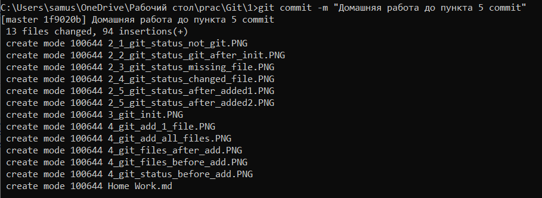
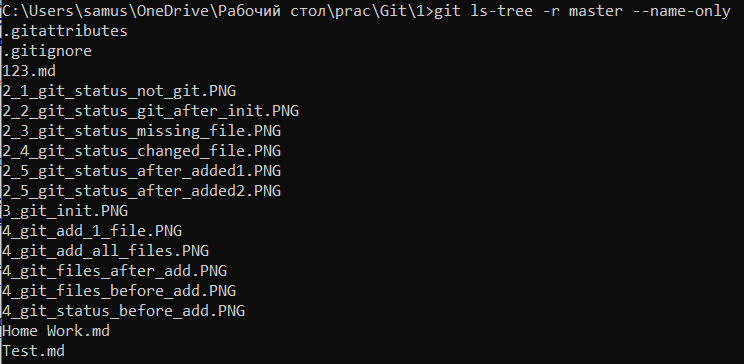
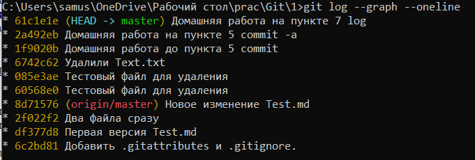

 #####   *Домашняя работа 1+2+3* 
  # Инструкция по работе с Git с одной и нескольким ветвями и с удаленным репозиторием #

##  1. Помощь с командами 
```
      git help
```
Используется для вывода в консоль доступных команд. 
Может быть использован в комбинации с другими командами для перехода к странице с более подробными пояснениями.

Пример:

```
      git help status
```
Данная команда откроет html страницу с полной инструкцией для команды *git status*

## 2. Cтатус репозитория
```
      git status
```
Указывает статус репозитория в указанной папке.

Примеры результатов выполнения

1. 

> В случае запроса в папке, не являющейся репозиторием (отсутствует папка **.git**).

2. 

> В случае запроса в папке, являющейся репозиторием, когда все файлы находятся в репозитории и не были изменены.

3. 

> В случае запроса в папке, являющейся репозиторием, когда **не** все файлы находятся в репозитории, но изменений в существующие файлы **небыло**. Также файлы не были внесены в список для подтверждения. Для внесения в список может использоваться команда ***[git add <file_name>](##4.-Добавление-в-репозиторий)*** или ***[git add -A](##4.-Добавление-в-репозиторий)*** для добавления всех файлов.   Отсутствующий файл отмечается <span style="color: red">красным</span> цветом.

4. 

> В случае запроса в папке, являющейся репозиторием, когда все файлы находятся в репозитории, но **были** внесены изменения в существующие файлы.Для внесения изменений в список может использоваться команда ***[git add <file_name>](##4.-Добавление-в-репозиторий)*** или ***[git add -A](##4.-Добавление-в-репозиторий)*** для добавления всех файлов или можно сразу использовать команду ***[git commit -a](##5.-Подтверждение-внесения-изменений)*** для моментального изменения в **существующих** в репозитории файлах. Измененный файл отмечается <span style="color: red">красным</span> цветом.

5. 

> 

> После применения команды ***[git add <file_name>](##4.-Добавление-в-репозиторий)*** или ***[git add -A](##4.-Добавление-в-репозиторий)*** выводится список всех файлов, которые могут быть добавлены репозиторий командой ***[git commit](##5.-Подтверждение-внесения-изменений)***. Изменяемый или добавляемый файл отмечается <span style="color: green">зеленым</span> цветом.

6. При работе с удаленным репозиторием, если были совершены commit-ы в локальном репозитории будет указано на сколько коммитов вы отличаетесь от удаленного репозитория (источника).

> 

> Обратите внимание, что это условное значение, так как локальный git не отслеживает, были ли внесены изменения в удаленном репозитории после того, как их сохранили для работы в локальной версии.


<span style="color: red">Примечание </span>
  1. <span style="color: red">В первой строке указывается название активной ветви. В данном случае ветвь называется _reduct_2_status_ </span>
    


## 3. Инициализация репозитория
```
      git init
```


Инициализирует Git и создает скрытую локальную папку .git

## 4. Добавление в репозиторий
```
      git add
```
Применяется для добавления файлов к списку файлов, которые после применения команды ***[git commit](##5.-Подтверждение-внесения-изменений)*** ,будут внесены в репозиторий. 

Пример:
Для начала посмотрим какие файлы находятся в репозитории.


При применении ***[git status](##2.-Cтатус-репозитория)*** видим, что необходимо добавить несколько файлов.


Добавляем 1 файл командой ***[git add <file_name>](##4.-Добавление-в-репозиторий)***, file_name - *"Home Work.md"*


Также можно добавить все файлы сразу используя ***[git add -A](##4.-Добавление-в-репозиторий)***


Повторно проверим файлы в репозитории.


Как видим файлы не добалены в репозиторий. Они поставлены только в очередь для добавления. Для завершения операции необходимо применить команду ***[git commit](##5.-Подтверждение-внесения-изменений)***

<span style="color: red">Примечание </span>
  1. <span style="color: red">Перед применением данной команды необходимо сохранить файл, иначе изменения в полной форме в репозиторий внесены не будут. </span>
  2. <span style="color: red">Можно вынуть из списка файлы командой ***[git rm --cached](##10.-Удаление-файлов-из-репозитория)*** </span>
  3. <span style="color: red">Можно добавить все файлы одного формата записав команду следующим образом ***[git add "*.txt"](##4.-Добавление-в-репозиторий)*** </span>

## 5. Подтверждение внесения изменений
```
      git commit
```
Подтверждает добавление и изменение репозитория.

Для начала посмотрим список файлов после ***[git add](##4.-Добавление-в-репозиторий)*** и статус репозитория.


Как видим некоторые файлы не внесены в список подтверждения, а именно был изменен файл *"Home Work.md"* и не добавлены 2 изображения. 

Для начала применим ***[git commit](##5.-Подтверждение-внесения-изменений)***



Как ввидно а картинке было добавлено *-m "Домашняя работа до пункта 5 commit"*. *-m "message"* применяется для комментирования/именования изменения, которое сохраняется.

Повторно  посмотрим список файлов и статус репозитория.




Как видим файлы, которые не были подтверждены командой (<span style="color: red">красные</span>) ***[git add](##4.-Добавление-в-репозиторий)*** не были внесены в репозиторий. 

Далее добавим при помощи команды ***[git add <file_name>](##4.-Добавление-в-репозиторий)*** файл *"5_git_commit.PNG"* в список для добавления (сделаем <span style="color: green">зелеными</span>). Таким образом чтобы повторить предыдущую ситуацию.

 
 
 Как показано на изображении существуют как недобавленые файлы, подтвержденные к добавлению так и неподтвержденная модификация.
 
 Применим модифицированную команду ***[git commit -a -m "Домашняя работа на пункте 5 commit -a"](##5.-Подтверждение-внесения-изменений)***. В данном случае добавляется модификатор *-a*.
 
 Результат:
 
  
 
 В результате выполнения команды были добавлены не только подтвержденные файлы (<span style="color: green">зеленые</span>), но и неподтвержденные модифицированные файлы (<span style="color: red">красные</span>), в то время как неподтвержденные несуществующие в репозитории файлы добавлены не были. Для них предварительно надо применять команду ***[git add](##4.-Добавление-в-репозиторий)***.
 
 <span style="color: red">Примечание </span>
  1. <span style="color: red">Перед применением данной команды необходимо сохранить файл, иначе изменения в полной форме в репозиторий внесены не будут. </span>
  2. <span style="color: red">Не всегда выгодно применять модификатор  *-a*, так как применение ***[git add <file_name>](##4.-Добавление-в-репозиторий)*** позволяет вынуть из списка файлы командой ***[git rm --cached](##10.-Удаление-файлов-из-репозитория)*** </span>
  3. <span style="color: red"> модификатор *--amend* позволяет вносить изменения в последний commit </span>
  4. <span style="color: red"> *-m "message"* не является уникальным для репозитория, и могут повторяться </span>
  

## 6. Файлы в репозитории
```
     git ls-tree -r master --name-only
```
Показать только файлы, которые сейчас существующие в данной ветке репозитория. ***"master"*** - это название ветви репозитория, в данном случае это главная/основная ветвь.

<span style="color: red">Примечание </span>
1. <span style="color: red"> В папке могут также существовать неотслеживаемые или недобавленые файлы, а также файлы из других ветвей. Данные файлы не будут добавлены в список.</span>

## 7. История коммитов(версий)
```
     git log
```
Применяется для вывода данных о всех случаях применения команды ***[git commit"](##5.-Подтверждение-внесения-изменений)***.
В результате запроса выдает список версий от самой последней к самой старой.


Как видно из изображения, результат запроса содержит:
- уникальный идентификационный номер commit-а (<span style="color: gold">Золотой </span>), используемый для обращения в других командах
- наименование автора commit-а, 
- дату и время создания,
- комментарий, указываемый при создании (*-m "message"*).  

Напротив последнего (по времени) комита указывается обозначение HEAD и наименование ветви версии (в данном случае это главная ветвь ***"master"***)

Для отрисовки при наличии других веток commit-ов может применен модификатор *--graph*, но будут показаны только связанные ветви до указанного commit-а.

Также для удобства можно выводить commit-ы компактно используя модификатор *--graph --oneline*, который выводит сокращенный идентификатор и комментарий.

Пример:



При работе с ветвями можно дополнительно использовать комбинацию модификаторов *--all --graph --oneline --decorate*. Таким образом будет выведены все ветви, существующие в репозитории до конца.
 

Пример с ветвями:


Как видно из рисунка в первом случае на первой картинке видны только ветви связанные с commit-ом **e3875c9** и ветвью ***"master"***, а во втором случае видны все существующие commit-ы во всех ветвях. 

<span style="color: red">Примечание </span>
1. <span style="color: red"> В случае слишком большого списка commit-ов программа запросит прекащения отображения. Это выполняется нажатием клавиши ***"q"***</span>
2. <span style="color: red"> Можно подробно посмотреть каждый commit используя команду ***git show идентификатор commit-а***</span>

## 8. Путешествие по версиям
```
     git checkout
```

Применяется для перехода на какой либо commit, при помощи его идентификатора, полученного  командой  ***[git log](##7.-История-коммитов(версий))*** (<span style="color: gold">золотой </span>).

Пример:
1. Для начала проверим список файлов


Как видим из рисунка их 24

2. Используя команду ***[git checkout 6742c62348c69dbedbaf02b9f6a626e4d1831f12 ](##8.-Путешествие-по-версиям)*** вернёмся к моменту до создания данного файла


3. Проверим новый log и список файлов в репозитории


> Видно, что лог теперь воспринимает как HEAD тот commit, чей идентификатор мы указали, а также то, что количество файлов уменьшилось до момента перед написанием данного файла. Также если проверить папку, то мы увидим, что фалы, добавленные после этого commit-а были удалены.

4. Возврат к текущему (последнему) изменению осуществляется при помощи команды ***[git checkout master ](##8.-Путешествие-по-версиям)***, где ***"master"*** это название основной ветви (могут быть названия других ветвей если необходимо вернуться к ним). По итогу все файлы в папках, а также все log в репозитории восстанавливаются.

Данная команда может быть применена не только для перехода по commit-ам по вертикали их создания, но и для перехода между ветвями репозитория. Для этого необходимо вместо идентификатора указать наименование ветви, в которую надо перейти (***[git checkout имя_ветви](##8.-Путешествие-по-версиям)***).

Применяя модификатор *-b new_branch_name* можно сразу создать новую ветвь и перейти в неё.

<span style="color: red">Примечание </span>
1. <span style="color: red"> Идентификатор в команде ***[git checkout](##8.-Путешествие-по-версиям)*** можно брать в сокращенном виде, как тот, который выдает ***[git log --graph --oneline](##7.-История-коммитов(версий))***.</span>

## 9. Различие версиий
```
     git diff
```
Показывает отличия между commit-ами.

Если ввести команду без модификаторов показывает отличие между недобавленным (текущим, но **сохраненным**) состоянием файлов и последним commit-ом.


Также можно добавить модификатор с индексом, с которым будет проводиться сравнение, или до которого будет проводиться сравнение.


На рисунке представлено сравнение между двумя последними commit-ами. Можно увидеть, что был добавлен бинарный файл (картинка) с названием *"8_git_diff.PNG"*, а также в данном файле были внесены изменения после 201 строчки.

команду можно использовать для сравнения двух ветвей, для отображения отличий в них. Для этого необходимо указать названия сравниваемых ветвей ***[git diff name_of_1_branch name_of_2_branch](##9.-Различие-версиий)***

## 10. Удаление файлов из репозитория
```
     git rm
```

Используется для удаления файлов из репозитория. После применения необходимо выполнить команду ***[git commit](##5.-Подтверждение-внесения-изменений)***. Вернуть файл возможно применив команду **[git checkout ](##8.-Путешествие-по-версиям)***

<span style="color: red">Примечание </span>
1. <span style="color: red"> Можно использовать для отделения файлов из списков для подтверждения применяя модификатор *--cached*. </span>
2. <span style="color: red"> Можно удалить все файлы одного формата записав команду следующим образом ***[git rm "*.txt"](##10.-Удаление-файлов-из-репозитория)*** </span>

## 11. Создание ветвей
```
     git branch
```
Используется для работы с ветвями.

1. При использовании в чистом виде (***[git branch](##11.-Создание-ветвей)***) выводит список всех ветвей. <span style="color: gold">Зеленым </span> отображается активная в данный момент ветвь. Пример:

2. При использовании с именем (***[git branch name_of_new_branch](##11.-Создание-ветвей)***) создает ветвь с указанным наименованием. В случае успеха никаких сообщений не выводится. Обязательно после этого переходить в нужную ветвь командой ***[git checkout name_of_new_branch](##8.-Путешествие-по-версиям)***
3. Применение модификатора *-d* с наименованием ветви удаляет данную ветвь. Но если ветвь имеет файлы или модификации, отсутствующие в связанной ветви, то будет выдано предупреждение. Пример:

 
 
 
 

## 12. Слияние ветвей
```
     git merge
```
Используется для слияния двух ветвей текущей и указанной в команде. Во время слияния могут возникнуть ошибки, которые должны быть устранены. После устраненияошибок необходимо использовать команду ***[git commit](##5.-Подтверждение-внесения-изменений)*** для завершения операции. Для отмены слияния при возникновении ошибки можно использовать модификатор *--abort*.

Пример слияния без ошибок:


Пример слияния с ошибкой в текстовом формате:
```

<<<<<<< HEAD
> Данный текст был написан в основной ветке для этого пункта *reduct_12_merge*. С этой веткой будет происходить слияние.

=======
> А этот текс был написан во вспомогательной ветке *reduct_12_merge_for_error*, которую планируется слить с основной.

>>>>>>> reduct_12_merge_for_error

```

Как видно сверху программа не смогла сама определить, какая из ветвей правильная и предоставила данную операцию нам на исправление. Сверху представлены данные из первой ветви, а снизу из второй. В консоли была выдана следующая надпись:


Статус же выглядит следующим образом:


Но не всегда конфликт возникает в текстовых файлах, которые могут быть исправлены подобным образом. Например в следующем случае была попытка слить две ветви с файлами - картинками (бинарными файлами), различными по содержанию, но одинаковыми по названию. Для исправления рекомендуется слелать  *--abort*, провести например переименование, а потом повторить слияние.


## 13. Игнорирование файлов

В некоторых ситуациях требуется сделать файлы, которые не будут отслеживаться репозиторием. например для файлов, которые должны создаваться в ходе работы программы, или например картинки. В этих целях в папке ( <span style="color: red">В той же папке, где находиться папка ***.git*** </span>) необходимо создать (если его нет) и изменить файл ***".gitignore"***. В этом файле в текстовом редакторе нужно указать имя файла с разрешением, который не должен отслеживаться. 

## 15. Отслеживание репозиториев
```
     git remote
```
Выодит список отслеживаемых репозиториев.


Применив модификатор *-v* можно получить более подробный список с указанием URL адресов. 
Пример:


Как видно на примере указывается репозиторий с 2 ссылкам:
1. источник, из которого берётся информация при работе судаленным репозиторием,
2. цель, в которую будут вноситься изменения

## 16. Работа с репозиториями
```
     git clone
```
Копирует указанный репозиторий с различными спецификациями в новый локальный репозиторий. 
1. Источник - удаленный репозиторий. 

> 

> Для копирования необходимо написать команду ***[git clone источник](##16.-Работа-с-репозиториями)***. Источник берется из *github*. Это может быть *HTTPS* ссылка или *SSH* ключ. При использовании ссылки может понадобиться указать логин и пароль, если они не указаны в какой либо доп. программе.

2. Источник - локальный репозиторий. Иногда может понадобиться сделать копию локального репозитория. для этого используется команда ***[git clone -l источник](##16.-Работа-с-репозиториями)***.


<span style="color: red">Примечание </span>

1. <span style="color: red"> Клонировать можно в паку, в которой не существует другого локального репозитория </span>
2. <span style="color: red"> Во время копирования создается папка, в которой будет находиться локальный репозиторий, поэтому при работе через консоль/терминал необходимо перейти в эту папку для дальнейшей работы</span>
1. <span style="color: red"> Модификатор * --depth* позволяет копировать указанное количество последних commit-ов.</span>
```
     git push
```
Обновляет удаленный репозиторий. 


Для обновления необходимо необходимо указать куда и какую ветвь (***[git push куда (origin) ветвь (pics)](##16.-Работа-с-репозиториями)***). 
- Если писать без указания ветви, то будет отпралена текущая ветвь. 
- для отправки всех ветвей можно использовать модификатор *--all*
- если не указывать ничего (***[git push](##16.-Работа-с-репозиториями)***) то будут использоваться default настройки указанные в конфигурациях. 

```
     git pull
```
Достает данные из удаленного репозитория в ***существующий*** локальный репозиторий. Во время работы команда не только копирует, но и производит слияние (как команда ***[git merge](##12.-Слияние-ветвей)***) всех ветвей, поэтому могут возникнуть конфликты, которые необходимо будет решить.

Пример с ошибкой:


## Использованные средства

- ОС - Windows
- Редактор Markdown - Notepad++
- Консоль Windows
- Visual Studio


