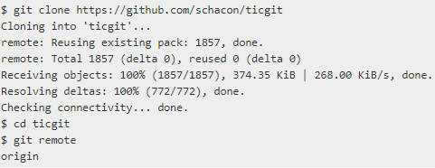
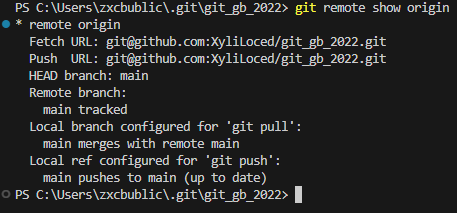

# Репозиторий для тренировки

Делаем себе fork, вносим изменения и присылаем Pull request.

## Инструкция по работе с удалённым репозиторием

### Просмотр удалённых репозиториев
Для того, чтобы просмотреть список настроенных удалённых репозиториев, используеться команда git remote — она выведет названия доступных удалённых репозиториев. Если вы клонировали репозиторий, то увидите как минимум origin — имя по умолчанию, которое Git даёт серверу, с которого производилось клонирование.

### Клонирование репозитория
Что бы клонировать репозиторий с GitHuba достаточно ввести команду git clone git@github.com:XyliLoced/test_gb_1.git (HTTPS,SSH) 

### Добавление удалённых репозиториев

 Для того, чтобы добавить удалённый репозиторий и присвоить ему имя (shortname), просто выполните команду git remote add <shortname> <url>

Теперь вместо указания полного пути вы можете использовать pb. Например, если вы хотите получить изменения, которые есть у Пола, но нету у вас, вы можете выполнить команду git fetch pb

### Получение изменений из удалённого репозитория — Fetch и Pull

Как вы только что узнали, для получения данных из удалённых проектов, следует выполнить:$ git fetch [remote-name]

Данная команда связывается с указанным удалённым проектом и забирает все те данные проекта, которых у вас ещё нет. После того как вы выполнили команду, у вас должны появиться ссылки на все ветки из этого удалённого проекта, которые вы можете просмотреть или слить в любой момент.

Когда вы клонируете репозиторий, команда clone автоматически добавляет этот удалённый репозиторий под именем «origin». Таким образом, git fetch origin извлекает все наработки, отправленные на этот сервер после того, как вы его клонировали (или получили изменения с помощью fetch). 

**Команда git fetch забирает данные в ваш локальный репозиторий, но не сливает их с какими-либо вашими наработками и не модифицирует то, над чем вы работаете в данный момент.** 

Вам необходимо вручную слить эти данные с вашими, когда вы будете готовы.

Если ветка настроена на отслеживание удалённой ветки, то вы можете использовать команду git pull чтобы автоматически получить изменения из удалённой ветки и слить их со своей текущей. Этот способ может для вас оказаться более простым или более удобным. К тому же, по умолчанию команда git clone автоматически настраивает вашу локальную ветку master на отслеживание удалённой ветки master на сервере, с которого вы клонировали репозиторий. Название веток может быть другим и зависит от ветки по умолчанию на сервере. Выполнение git pull, как правило, извлекает (fetch) данные с сервера, с которого вы изначально клонировали, и автоматически пытается слить (merge) их с кодом, над которым вы в данный момент работаете.

### Отправка изменений в удалённый репозиторий (Push)

Когда вы хотите поделиться своими наработками, вам необходимо отправить их в удалённый репозиторий. Команда для этого действия простая: git push <remote-name> <branch-name>. Чтобы отправить вашу ветку master на сервер origin (повторимся, что клонирование обычно настраивает оба этих имени автоматически), вы можете выполнить следующую команду для отправки ваших коммитов: **$ git push origin master**

Эта команда срабатывает только в случае, если вы клонировали с сервера, на котором у вас есть права на запись, и если никто другой с тех пор не выполнял команду push. Если вы и кто-то ещё одновременно клонируете, затем он выполняет команду push, а после него выполнить команду push попытаетесь вы, то ваш push точно будет отклонён. Вам придётся сначала получить изменения и объединить их с вашими и только после этого вам будет позволено выполнить push.

### Просмотр удалённого репозитория

Если хотите получить побольше информации об одном из удалённых репозиториев, вы можете использовать команду git remote show <remote>. Выполнив эту команду с некоторым именем, например, origin.

Она выдаёт URL удалённого репозитория, а также информацию об отслеживаемых ветках. Эта команда любезно сообщает вам, что если вы, находясь на ветке master, выполните git pull, ветка master с удалённого сервера будет автоматически влита в вашу сразу после получения всех необходимых данных. Она также выдаёт список всех полученных ею ссылок.

Данная команда показывает какая именно локальная ветка будет отправлена на удалённый сервер по умолчанию при выполнении git push. Она также показывает, каких веток с удалённого сервера у вас ещё нет, какие ветки всё ещё есть у вас, но уже удалены на сервере, и для нескольких веток показано, какие удалённые ветки будут в них влиты при выполнении git pull.

### Удаление и переименование удалённых репозиториев
Для переименования удалённого репозитория можно выполнить git remote rename. Например, если вы хотите переименовать pb в paul, вы можете это сделать при помощи git remote rename

$ git remote rename pb paul

$ git remote 

Стоит упомянуть, что это также изменит имена удалённых веток в вашем репозитории. То, к чему вы обращались как pb/master, теперь стало paul/master.

Если по какой-то причине вы хотите удалить удалённый репозиторий — вы сменили сервер или больше не используете определённое зеркало, или кто-то перестал вносить изменения — вы можете использовать git remote rm:

$ git remote remove paul

**При удалении ссылки на удалённый репозиторий все отслеживаемые ветки и настройки, связанные с этим репозиторием, так же будут удалены.**