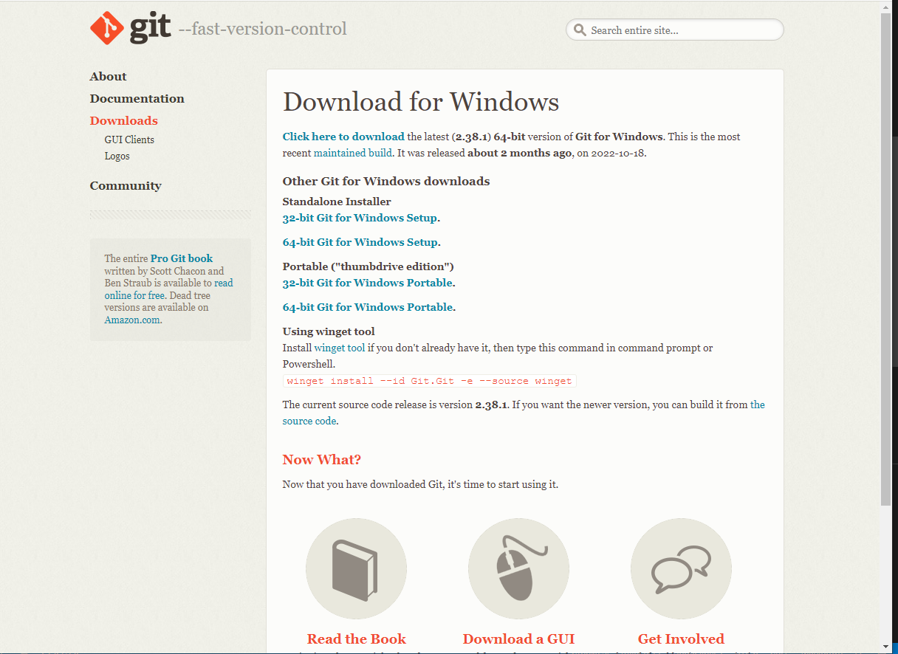

# Репозиторий для тренировки

Делаем себе fork, вносим изменения и присылаем Pull request.

# Инструкция по Git

## Инструкция по установке Git

1. Устанавливаем VS Code по ссылке: https://code.visualstudio.com/

2. Устанавливаем Git по ссылке https://git-scm.com

  ## Скриншот сайта установки Git

3. После установки запускаем Git Bash

* ## Выполняем команды: 
    1. git -- version **(Покажет версию Git)**
    2. pwd **(проверит в какой мы директории(папке))**
    3. mkdir testgit **(создаем директорию(папку testgit))**
    4. cd testgit **(заходим в папку) ("cd .." - выйти с папки)**
    5. git init **(иницилизируем Git-репозиторий)**
    6. touch readme.md **(создаем пустой файл)**
    7. git add readme.md **(добавить этот файл в индекс)**
    8. git status **(проверить что у нас в индексе)**
    9. git commit -m "readme add" **(закомментим(зафиксируем) файл readme.md )**
    10. git config -- global user.email"user@email.com" **(создаем почту)**
    11. git config -- global user.name "You_name"**(создаем имя)**
    12. git commit -m "readme add" **(закоммитить удалось)**
    13. git log **(покажет список всех коммитов)**

## Прочие полезные команды

* git add -A **(Сохранить все файлы сразу)**
* git log --graph --oneline **(показать все ветки в коммитах)**
* git checkout 54jhe345 (айди старого коммита)**(удаление новых изменений)**
* git checkout master **(вернуть все удаленное)**
* git diff **(сравнение прошлого сохранения файла с существующим сохранением)**

* git rm text.txt **(удаление файла text.txt)**

## **Работа с удаленным репозиторием**

* git remote -v **(показывает внешние репозитории)**
* git clone https://... **(скопировать внешний репозиторий)**
* git pull **(скачать всю актуальную информацию и автоматически сделать merge )**
* git push origin main **(отправить нашу версию на внешний репозиторий)**
* git push --set-upstream origin pics **(влить ветку в GitHub (Pull recuest))**

## **_Как сгенерировать SSH-ключ в Windows 10_**

1. Откройте командную строку
2. Введите ssh-keygen и нажмите Enter
3. Приложение запросит место сохранения по умолчанию, например: C:\users\name_users\.ssh\id_rsa
4. Затем, вам будет предложено ввести кодовую фразу, этот этап можно пропустить, нажав Enter
5. Наконец, вы можете посмотреть ваш ключ в C:\users\name_users\.ssh\id_rsa.p
6. Скопируйте его и вставьте в ваш SSH-ключ на GitHub в настройках вашего профиля.

7. Сохраните этот ключ.