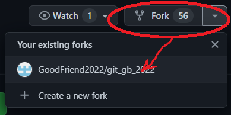

# Репозиторий для тренировки

Делаем себе fork, вносим изменения и присылаем Pull request.

# Инструкция по работе с удаленным репозиторием

>для начала [создаем ключи SHH](https://docs.github.com/en/authentication/connecting-to-github-with-ssh/generating-a-new-ssh-key-and-adding-it-to-the-ssh-agent)

## Копируем интересующий нас репозиторий в свой Github

Нажимаем на кнопку Fork в выбраном репозитории 

>Переходим в свой профиль на GitHub

Далее необходимо скопировать ссылку на выбранный репозиторий, который должен был появиться в профиле, с помощью протокола SHH

Переходим в VS, где в командной строке пишем *git clone* и вставляем скопированную ссылку.

## Создаем локальный репозиторий

Для создания локального репозитория пишем в командной строке *cd название скопированного репозитория*

# Вносим изменения

>Для работы в чужом репозитории создаем новую ветку

Далее работаем в скопированном репозитории, добавляем, коммитим (всё по классике жанра)

