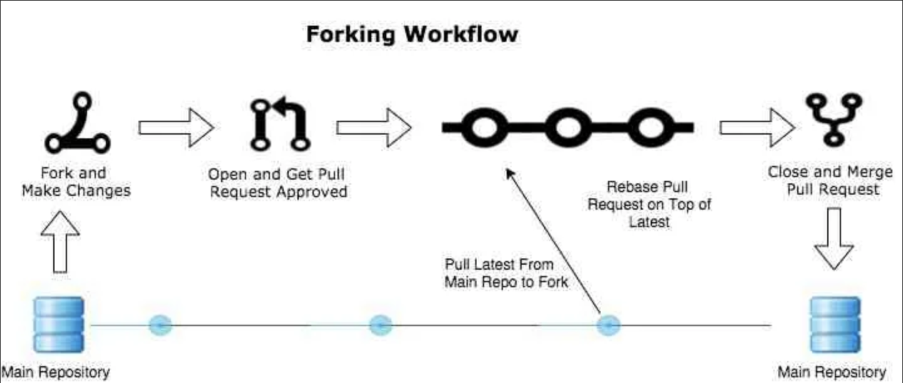

# Репозиторий для тренировки

Делаем себе fork, вносим изменения и присылаем Pull request.

## Информация о работе с удаленными репозиториями

1. Форкните проект.
2. Склонируйте репозиторий.
3. Создайте ветку для своей работы.
4. Сделайте необходимые изменения в файлах — коде, документации, тестах. Закоммитьте их в только что созданную ветку.
5. Убедитесь, что проект работает после ваших изменений.
6. Сделайте Pull Request.
> Обсудите его с рецензентом в процессе Code Review. При необходимости, внесите изменения в свой Pull Request.
Когда все довольны, Pull Request принимают — с этого момента ваши изменения попали в исходный репозиторий (upstream) и являются частью проекта.

