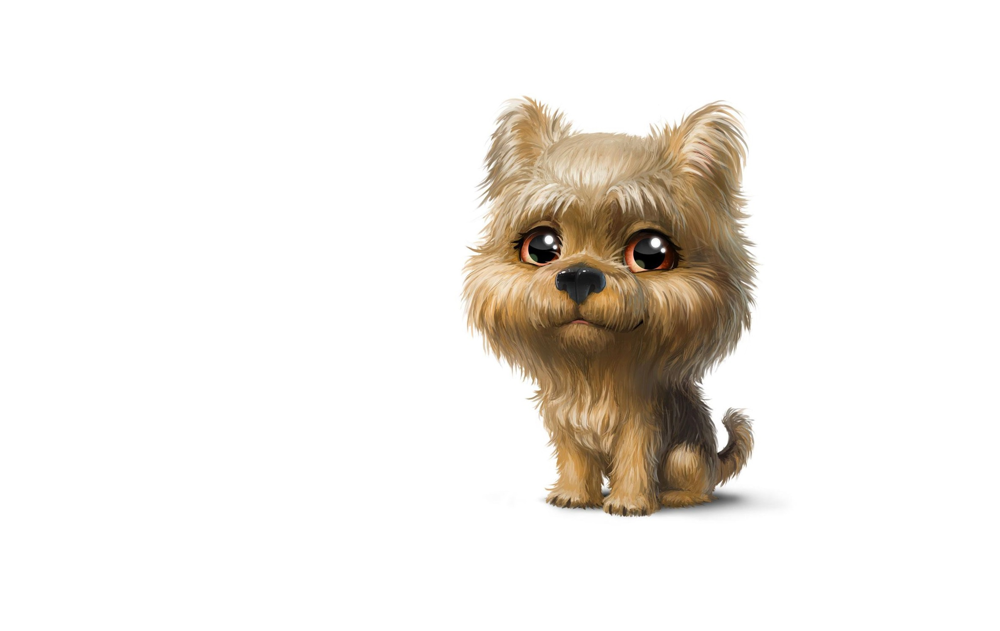

# Репозиторий для тренировки

Делаем себе fork, вносим изменения и присылаем Pull request.

## Локальное изменение 

Картинка
 

 
Список:

1. Первый.
2. Второй. 
3. Третий.
## Локальное изменение

Список:

* Первый.
* Второй. 
* Третий. 

[def]: dog.jpg