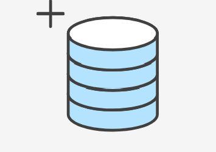

# Руководство по GIT

## Контроль версий

**Контроль версий**, также известный как управление исходным кодом, — это практика отслеживания изменений программного кода и управления ими. 

**Системы контроля версий** — это программные инструменты, помогающие командам разработчиков управлять изменениями в исходном коде с течением времени.

Управление версиями помогает отдельным разработчикам работать быстрее, а командам по разработке ПО — сохранять эффективность и гибкость по мере увеличения числа разработчиков.

**GIT** - является лидером по популярности среди современных систем управления версиями.


# Что такое Git?

**Git** — система управления версиями с распределенной архитектурой.

**Git** — абсолютный лидер по популярности среди современных систем управления версиями. Это развитый проект с активной поддержкой и открытым исходным кодом. Система **Git** была изначально разработана в 2005 году *Линусом Торвальдсом* — создателем ядра операционной системы *Linux*.

### Преимущества

- *Производительность*

**Git** показывает очень высокую производительность в сравнении со множеством альтернатив. Это возможно благодаря оптимизации процедур фиксации коммитов, создания веток, слияния и сравнения предыдущих версий. Алгоритмы **Git** разработаны с учетом глубокого знания атрибутов, характерных для реальных деревьев файлов исходного кода, а также типичной динамики их изменений и последовательностей доступа.

Некоторые системы управления версиями руководствуются именами файлов при работе с деревом файлов и ведении истории версий. Вместо обработки названий система **Git** анализирует содержимое. Это важно, поскольку файлы исходного кода часто переименовывают, разделяют и меняют местами. Объектные файлы репозитория **Git** формируются с помощью дельта‑кодирования (фиксации отличий содержимого) и компрессии. Кроме того, такие файлы в чистом виде хранят объекты с содержимым каталога и метаданными версий.

- *Безопасность*

При разработке в **Git** прежде всего обеспечивается целостность исходного кода под управлением системы. Содержимое файлов, а также объекты репозитория, фиксирующие взаимосвязи между файлами, каталогами, версиями, тегами и коммитами, защищены при помощи криптографически стойкого алгоритма хеширования *SHA1*. Он защищает код и историю изменений от случайных и злонамеренных модификаций, а также позволяет проследить историю в полном объеме.

Использование **Git** гарантирует подлинность истории изменений исходного кода.

В некоторых других системах управления версиями отсутствует защита от тайного внесения изменений. Это может стать серьезной угрозой информационной безопасности в любой организации, занимающейся разработкой ПО.

- *Гибкость*

Гибкость — одна из основных характеристик **Git**. Она проявляется в поддержке различных нелинейных циклов разработки, эффективности использования с малыми и крупными проектами, а также совместимости со многими системами и протоколами.

В отличие от *SVN*, система **Git** рассчитана прежде всего на создание веток и использование тегов. Поэтому процедуры с участием веток и тегов (например, объединение и возврат к предыдущей версии) сохраняются в истории изменений. Не все системы управления версиями обладают настолько широкими возможностями отслеживания.


[Подробнее...](https://www.atlassian.com/ru/git/tutorials/what-is-git)



## Настройка репозитория

### В данном руководстве обсуждаются следующие основные вопросы:

Инициализация нового репозитория **Git**

* Клонирование существующего репозитория **Git**
* Коммит измененной версии файла в репозиторий
* Конфигурирование репозитория **Git** для удаленной совместной работы
* Распространенные команды для управления версиями **Git**

[Репозиторий Git](https://bitbucket.org/product/ru/code-repository) — это виртуальное хранилище проекта. В нем можно хранить версии кода для доступа по мере необходимости.

```
git init - команда для создания нового репозитория используется команда
```
Выполнение команды приведет к созданию нового подкаталога .git в вашем рабочем каталоге. Кроме того, будет создана новая главная ветка.

В этом примере предполагается, что у вас уже есть папка проекта, в которой вы и хотите создать репозиторий. Выполните команду cd для перехода к папке проекта, а затем выполните команду git init.

Указание в команде git init существующего каталога проекта приведет к исполнению описанной выше инициализации, но только на уровне этого каталога проекта.

```
git clone <repo url> - команда для создания копии (клонирования) удаленного репозитория
```
После исполнения команды последние версии файлов из главной ветки удаленного репозитория будут загружены и помещены в новый каталог.

В качестве параметра в команду git clone передается URL-адрес репозитория. Git поддерживает несколько различных сетевых протоколов и соответствующих форматов URL-адресов. В этом примере используется SSH-протокол Git. URL-адреса SSH в Git имеют следующий шаблон: git@HOSTNAME:USERNAME/REPONAME.git

[Подробнее...](https://www.atlassian.com/ru/git/tutorials/setting-up-a-repository)


В данном руководстве обсуждаются следующие основные вопросы:

* Инициализация нового репозитория Git
* Клонирование существующего репозитория Git
* Коммит измененной версии файла в репозиторий
* Конфигурирование репозитория Git для удаленной совместной работы
* Распространенные команды для управления версиями Git

## Сохранение изменений


В Git и других системах управления версиями концепция сохранения проработана более детально, чем в текстовых процессорах или других традиционных приложениях для редактирования файлов.

В **Git** и других системах управления версиями концепция сохранения проработана более детально, чем в текстовых процессорах или других традиционных приложениях для редактирования файлов. Традиционный термин «сохранение» в программировании синонимичен понятию коммита в **Git**. Коммит в **Git** является эквивалентом сохранения. Традиционное сохранение — это операция файловой системы, которая используется для перезаписи существующего файла или записи нового. В отличие от нее, коммит **Git** выполняется над набором файлов и каталогов.

Процессы сохранения в **Git** и SVN также отличаются. Коммиты, или «фиксации», в SVN — это операции передачи на централизованный удаленный сервер. Это означает, что для «сохранения» изменений в проекте коммитам SVN необходим доступ в Интернет. Коммиты **Git** можно создавать и выполнять локально, а затем по мере необходимости отправлять на удаленный сервер с помощью команды git push -u origin main. Различие этих двух методов объясняется фундаментальными отличиями в архитектуре. В **Git** реализована модель распределенного приложения, а в SVN — модель централизованного приложения. Обычно распределенные приложения более устойчивы, поскольку не имеют единой точки отказа, такой как централизованный сервер.

 [Подробнее...](https://www.atlassian.com/ru/git/tutorials/saving-changes)


```
git add - добавляет изменение из рабочего каталога в раздел проиндексированных файлов.
```
Команда git add добавляет изменение из рабочего каталога в раздел проиндексированных файлов. Она сообщает Git, что вы хотите включить изменения в конкретном файле в следующий коммит. Однако на самом деле команда git add не оказывает существенного влияния на репозиторий: изменения регистрируются в нем только после выполнения команды git commit.

[Подробнее...](https://www.atlassian.com/ru/git/tutorials/saving-changes)

```
git commit делает для проекта снимок текущего состояния изменений, добавленных в раздел проиндексированных файлов.
```
 Такие подтвержденные снимки состояния можно рассматривать как «безопасные» версии проекта — Git не будет их менять, пока вы явным образом не попросите об этом. Перед выполнением команды git commit необходимо использовать команду git add, чтобы добавить в проект («проиндексировать») изменения, которые будут сохранены в коммите. Эти две команды, git commit и git add, используются чаще всего.
 
Различие в системах контроля:


Пример команды *commit*:

```
git commit -m "commit message"

```

Команда git commit делает для проекта снимок текущего состояния изменений, добавленных в раздел проиндексированных файлов. Такие подтвержденные снимки состояния можно рассматривать как «безопасные» версии проекта — Git не будет их менять, пока вы явным образом не попросите об этом. Перед выполнением команды git commit необходимо использовать команду git add, чтобы добавить в проект («проиндексировать») изменения, которые будут сохранены в коммите. Эти две команды, git commit и git add, используются чаще всего.

[Подробнее...](https://www.atlassian.com/ru/git/tutorials/saving-changes/git-commit)

```
git diff - представляет собой многоцелевую команду Git, которая инициирует функцию сравнения источников данных Git — коммитов, веток, файлов и т. д.

```
Сравнение — это функция, анализирующая два входных набора данных и отображающая различия между ними. git diff представляет собой многоцелевую команду Git, которая инициирует функцию сравнения источников данных Git — коммитов, веток, файлов и т. д. В этом документе описываются типичные варианты вызова git diff и схемы рабочего процесса сравнения. Зачастую вместе с командой git diff используются git status и git log для анализа текущего состояния репозитория Git.

[Подробнее...](https://www.atlassian.com/ru/git/tutorials/saving-changes/git-diff)

# Проверка репозитория


```
git status – получает информацию от git о его текущем состоянии
```
Команда *git status* отображает состояние рабочего каталога и раздела проиндексированных файлов. С ее помощью можно проверить индексацию изменений и увидеть файлы, которые не отслеживаются **Git**. 
```
git log - отображает отправленные снимки состояния и позволяет просматривать и фильтровать историю проекта, а также проводить поиск по ней
```
[Подробнее ...](https://www.atlassian.com/ru/git/tutorials/inspecting-a-repository)


# Отмена коммитов и изменений


В этом разделе мы обсудим доступные стратегии и команды **Git** для выполнения отмены изменений. Прежде всего необходимо отметить, что в **Git** не существует традиционной системы отмены, как в текстовых редакторах. Лучше воздержаться от сопоставления операций **Git** с какой бы то ни было традиционной концепцией отмены изменений. Кроме того, **Git** имеет собственную систему терминов для операций отмены, и в обсуждении лучше всего использовать их. В числе таких терминов — сброс (*reset*), возврат (*revert*), переключение (*checkout*), очистка (*clean*) и другие.

1. Просмотр старых коммитов
```
git log - один из лучших инструментов для просмотра истории репозитория Git
```
2. Просмотр старых версий
```
git checkout номер коммита - для просмотра коммита.
```
[Подробнее ...](https://www.atlassian.com/ru/git/tutorials/undoing-changes)


## Совместная работа

```
git clone <repo url> - команда для создания копии (клонирования) удаленного репозитория
```
После исполнения команды последние версии файлов из главной ветки удаленного репозитория будут загружены и помещены в новый каталог.

В качестве параметра в команду git clone передается URL-адрес репозитория. Git поддерживает несколько различных сетевых протоколов и соответствующих форматов URL-адресов. В этом примере используется SSH-протокол Git. URL-адреса SSH в Git имеют следующий шаблон: git@HOSTNAME:USERNAME/REPONAME.git

[Подробнее...](https://www.atlassian.com/ru/git/tutorials/setting-up-a-repository)

Команда git remote позволяет создавать, просматривать и удалять подключения к другим репозиториям. Удаленные подключения скорее похожи на закладки, чем на прямые ссылки на другие репозитории. Они служат удобными именами, с помощью которых можно сослаться на не очень удобный URL-адрес, а не предоставляют доступ к другому репозиторию в режиме реального времени.

