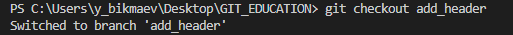
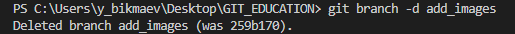

# Инструкция по работе с Git

## Установка Git в Linux

В операционных системах Debian

    $ sudo apt install git

В операционных системах CentOS

    $ sudo dnf install git-all

## Установка Git в Windows

Дистрибутив Git можно скачать по следующей ссылке - [Download Git](https://git-scm.com/download/win)

## Настройка

При первом использовании Git необходимо представиться. Для этого нужно ввести в терминале следующие команды:

        git config --global user.name "Ваше имя английскими буквами"
        git config --global user.email ваша_почта@example.com

## Основные команды Git

1. Инициализация локального репозитория 

        git init
    

2.  Получение информации от git о его текущем статусе

        git status
    

3. Добавить файлы к следующему коммиту

    >Перед выполнением данной команды необходимо сохранить изменения в файлах
     
        git add file_name.txt
          

    Для добавления (индексации) всех файлов в репозитории можно использовать следующие команды:
    
    * добавление всех файлов, в которых были изменения, а так же новых файлов текущего каталога и подкаталогов
            
            git add .
    * добавление всех новых и изменененных файлов, а так же исключение удаленных во всём репозитории

            git add -A

4. Cоздание коммита

        git commit -m "message" 
    

5. Вывод на экран истории всех коммитов с их хеш-кодами

        git log
    

6. Переход от одного коммита к другому

        git checkout 6_начальных_символов_хеш-кода_коммита
    
    >Если были произведены какие то изменения в файлах и не они не были закоммичены, команда не выполнится, чтобы не потерять изменения. Проигнорировать это позволяет ключ -f. Для автоматического сохранения изменений можно использовать ключ -m.

7. Возврат к актуальному состоянию для продолжения работы

        git checkout master
    

8. Вывод разницы между текущим и закоммиченным состоянием файла

        git diff
    

## Создание коммита в одной команде

Две команды  git add и git commit -m "message" можно объединить в одну
    
    git commit –am "message"
Эта команда одновременно проиндексирует файлы и закоммитит их. Новые файлы при этом индексироваться не будут.

## Команды Git для работы с ветками

1. Добавление ветки
        
        git branch name_branch
    

2. Вывод наименований существующих веток

        git branch
    
    
3. Переход в другую ветку

        git checkout name_branch
    

4. Слияние веток

        git merge name_branch
    
    
5. Удаление веток

        git branch -d name_branch
    

## Игнорирование файлов и каталогов в Git

В репозитории могут находиться файлы или каталоги которые не будут отслеживаться. Их целесообразно игнорировать в Git. Для этого необходимо создать файл .gitignore в корне или в нужном каталоге репозитория.

> Пример содержимого .gitignore 

        # строки начинающиеся на # - это комментарии, они не учитываются
        
        # Исключить все файлы с расширениеv .a
        *.a
        
        # Но отслеживать файл lib.a даже если он подпадает под исключение выше
        !lib.a
        
        # Исключить файл TODO в корневом каталоге, но не файл в subdir/TODO
        /TODO
        
        # Игнорировать все файлы в каталоге build/
        build/
        
        # Игнорировать файл doc/notes.txt, но не файл doc/server/arch.txt
        doc/*.txt
        
        # Игнорировать все .txt файлы в каталоге doc/
        doc/**/*.txt

    
## Вывод удобного для восприятия списка коммитов

При работе с командой *git log*, для удобства восприятия истории коммитов, можно использовать следющие ключи:

* --graph - вывод истории коммитов с графами
* --oneline - вывод коммита в одну строку
* -- graph --oneline - история коммитов будет отображаться с использованием обоих ключей

## Команды для работы с удаленным репозиторием

1. Создание локальной копии удаленного репозитория

            git clone http://remote.git
    

2. Получение изменений из удаленного репозитория и слияние с локальной версией

            git pull
    
    
3. Отправка локальной версии в удаленный репозиторий

    > При первой отправке система предложит авторизоваться в сервисе где хранится удаленный репозиторий
    
            git push
    
