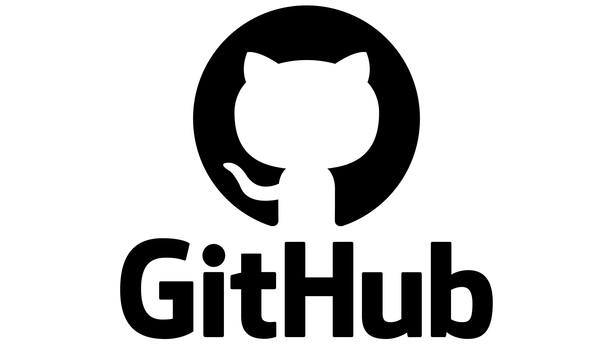

# Инструкция по использованию git

## Введение
Создателем git является финско-американский программист Линус Товальдс (также является основателем ОС Linux, соответственно отсюда и созвучие имени Линуса с созвучным нащванием оперативной системы)

# Работа с локальными репозиториями.
## Первый раздел. Алгоритм первых действий.
1. Создаем любую папку.
2. Открываем VS code.
3. Указываем в VS code путь к папке.
4. Привязываем данную папку через терминал с помощью команды "git init".
**Поздравляю, мы получили репозиторий.**
## Второй раздел. **Основые команды**.
* *git add '.\название файла.расширение файла'* - команда для добавления файла к отслеживанию;
* *git commit -m "Комментарий к сохранению"* - команда для сохранения состояния файла ( версии );
* *git diff* - команда, показывающая чем отличается текущий фал от сохраненного;
* *git checkout 000а* - команда вызывающая прошлую версию файла, где 000а - первые буквы сохраненной версии;
* *git checkout master* - позволяет вернуться к самой актуальной версии.
## Третий раздел. _Дополнительные команды_.
* *git log* - команда, показывающая журнал изменений;
* *git status* - команда, показывающая информацию (статус) файла;
* *git --version* - команда, показывающая версию используемого Git;
* *git config --global user.name "Название вашего логина\имени"* - команда, настраивающая име пользователя в Git;
* *git config --global user.email em@domain* - команда, настраивающая email пользователя Git;
* *dir* - команда, открывающая список файлов;
* *clear* - команда для очистки терминала.
## Четвертый раздел. Горячие клавиши.
* *TAB* - автозаполнение текста в командной строке;
* *ctrl + L*  - очистка терминала;
* *ctrl + S*  - сохранение изменений в файле.
## Справочная информация.

**_Git_** - консольная утлита для отслеживания и ведения истории изменений файлов в Вашем проекте.

Git сохраняет не файлы целиком, а разницу в этих файлов, что существенно помогает экономить память.

Любые сохранения Вашего проекта носят названия **_commit_**, а у каждого commit'a есть свой **_hash_** (уникальный id и комментарий).

Из таких commit'ов собиратся ветка. 

_**Ветка**_ - история изменений. У каждой ветки есть свое название. Основная называется- **master**.
## Пятый раздел. Ветки.
### _Основной список команд:_
* *git branch* - команда указывает в какой ветки находимся в данной время; 
* *git branch text* - команда позволяет создать дополнительную ветку с именем "text" ;
* *git checkout text* - команда позволяет перейти на ветку text для поледующей работы;
* *git merge* - команда для сливания веток;
* *git merge text* - команда сливает ветку text к той, в который мы сейчас находимся в данный момент;
* git branch -d text* - команда для удаления ветки text;
* *git log --graph* - параметр, который позволяет видеть историю в виде дерева;
* *git log -graph --oneline* - компатный вариант дерева.

# Работа с удаленными репозиториями. 

## Места хранения репозиторий в интернете ##
1. [GitHub](https://github.com/)
2. [Bitbucket](https://bitbucket.org/)
3. [GitLab](https://about.gitlab.com/)
 
 ## Принципиальные отличия.
 I. **Git** - программа установленная на компьютер.

 Одна из систем контрооля версий. Способ организации и поддержания версионности. Самая популярная система контроля версий.

 II. **GitHub** - сервис компании Microsoft, позволяющий настроить удаленную работу с git.
 
 Представляет Microsoft. Самый популярный сервис Git. Много полезных функций. Огромный архив различного кода.

 ### **A) Алгоритм, если "берем" репоззиторий.**
 Для работы с удаленным репозиторием:
 1) Заходим на GitHub, в поиске находим необходимые файлы.
 2) Копируем ссылку файла.
 3) Пишем команду в git: "*git clone ссылка*"
 4) Для корректной работы с появившемся репозиторием указываем путь к git при помощи команды: "*cd название_папки*".

 ### **Б) Алгоритм по отправлению репозитрия.**

 P.s: по второму варианту деяйствия из инструкции с сервиса GutHub:
 
 1) *git remote add origin http://...... .git*
 2) *git branch -M main*
 3) *git push -u origin main*

 п.1и2 позволяет "подружить" локальный и удаленный(remote) репозиторий. 
 
 **Origin** - название удаленного репозитория.
 
 ## Необходимые команды:
 * *git push* - команда для отправки (в переводе "направлять") обновлений версии файла на удаленный сервис;
 * *git pull* - команда для получения (в переводе "тянуть, стянуть") обновлений версии файла с удаленного сервиса + автоматически производит слияние подобно команде merge.

 ## Файлы с закрытого аккаунта GitHub.

 С закрытого аккаунта в GitHub необходимо сделать копию на свой аккаунт при помощи команды: fork
(после этого у себя уже можно менять что угодно)

- делаем *fork* репозитории;
- делаем *clone* СВОЕЙ версии репозитория;
- создаем новую ветку и в НЕЕ носим изменения;
- фиксируем изменения (делаем коммиты);
- отправляем свою версию в свой GitHub;
- на сайте GitHub нажимаем кнопку *pull request*.