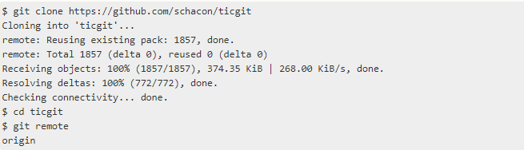

# Работа с удалёнными репозиториями

Для того, чтобы внести вклад в какой-либо Git-проект, вам необходимо уметь работать с удалёнными репозиториями. Удалённые репозитории представляют собой версии вашего проекта, сохранённые в интернете или ещё где-то в сети.

## Просмотр удалённых репозиториев
Для того, чтобы просмотреть список настроенных удалённых репозиториев, вы можете запустить команду git remote. Она выведет названия доступных удалённых репозиториев. Если вы клонировали репозиторий, то увидите как минимум origin — имя по умолчанию, которое Git даёт серверу, с которого производилось клонирование:

